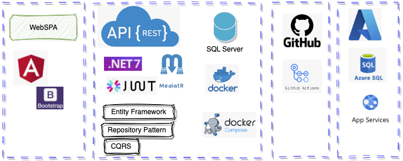
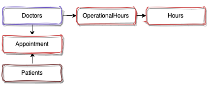
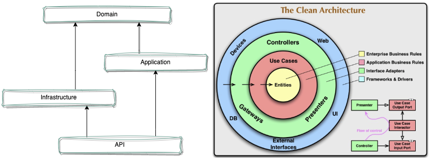
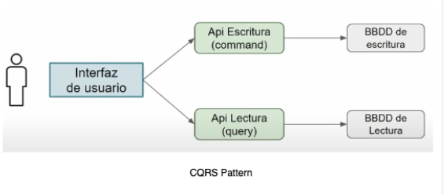
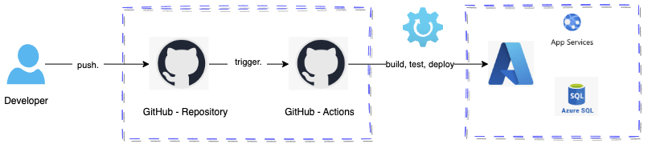

# Introduction

This is a project that allows scheduling medical appointments, doctors can configure the hours they will be able to see patients, and see the scheduled appointments. Patients can create an appointment after selecting a professional.

I used different technologies to build the application, such as .NET 7, Entity Framework, SQL Server, Docker, Azure App Service, GitHub Actions, and Angular.

Look an overview of the technologies used in the project:



# Authentication

The following doctors and patients were pre-configured to perform the demo.

- doctor1@gmail.com
- doctor2@gmail.com
- doctor3@gmail.com
- doctor4@gmail.com
- doctor5@gmail.com
- patient1@gmail.com
- patient2@gmail.com
- patient3@gmail.com
- patient4@gmail.com
- patient5@gmail.com

The password can be 123

[app screenshots](resourcesreadme/README.md)

# Database diagram



# For Dev
## Used development tools

- macOS
- vscode
- vs studio for mac
- docker desktop to use sql server
- Azure Data Studio: Client to SQL Server

## Enable database server using docker

Enable database server using docker. Docker is a software platform that allows you to quickly build, test, and deploy applications.

[See how to configure sql server with docker](resources_container_sqlserver/README.md)

## Setup database

SQL server and entity framework were used, the first migration is required to be run from the infrastructure layer.

```bash
# Inside the Scheduling.Infrastructure folder
# Create a migration
dotnet ef --startup-project ../Scheduling.API/ migrations add InitialCreate
# Apply the migration
dotnet ef --startup-project ../Scheduling.API/ database update
```

# Web API

I followed recommendations from Domain Driven Design architectures and [clean arquitecture](https://blog.cleancoder.com/uncle-bob/2012/08/13/the-clean-architecture.html), I used version 7 of .NET, used Entity Framework with the code first approach, implemented CQRS using packages such as MediaTR, FluentValidation and AutoMapper, worked on a database in SqlServer.

# Layer structure



Domain Drive Design and clean architecture agree that they are a collection of principles, design patterns and good practices that help organize the code in such a way that it is understandable, testable, and easy to maintain over time.

I created 4 layers in the application, making an equivalence as shown in the image, the arrows indicate the dependency between the layers, one of the main points of Clean Architecture is the dependency rule where code dependencies can only come from the external levels inward and the external layers should not have knowledge of the functions of the external layers.

Maintaining the dependency rule keeps layers easy to replace if required and maintains the principle of separation of concerns (IoC separation of concerns).

The principle of dependency inversion is achieved by implementing abstractions through interfaces, for example in a traditional layered application, the Application layer may need to access the infrastructure layer to store a record in the database (and the relationship is direct, application needs infrastructure). In Clean Architecture, the relationship is inverted, the infrastructure layer implements an interface defined in the application layer, so the application layer does not need to know the details of the infrastructure layer, it only needs to know the interface.

# API Layer

The API layer is the entry point of the application, it is responsible for receiving the requests and returning the responses, it is the layer that communicates with the outside world, it is responsible for receiving the requests, validating the data, and sending the data to the application layer, it is also responsible for returning the responses to the client.

# Application Layer

The application layer is responsible for the business rules, it is the layer that contains the use cases of the application, it is responsible for orchestrating the flow of data between the layers, it is responsible for receiving the data from the API layer, validating the data, and sending the data to the domain layer, it is also responsible for returning the responses to the API layer.

# Domain Layer

The domain layer is the heart of the application, it is responsible for representing the business rules, it is the layer that contains the entities, value objects, and domain services.

# Infrastructure Layer

The infrastructure layer is responsible for the implementation of the external tools, it is responsible for the implementation of the database, the implementation of the email service, the implementation of the file system, etc. In this project, the infrastructure layer is responsible for the implementation of the database, and use the Entity Framework to access the database.

# CQRS

CQRS is a pattern that separates the read and write operations of an application, it is a pattern that separates the commands (write operations) from the queries (read operations), it is a pattern that allows the application to scale the read and write operations independently, it is a pattern that allows the application to have different models for the read and write operations. The advantages of using CQRS are: scalability, performance, and maintainability. In this project, I used the MediatR package to implement the CQRS pattern.



# Integration tests

I used the xUnit and FluentAssertions packages to implement the integration tests, the integration tests are responsible for testing the application in an integrated way.

In the Scheduling.API.Tests project, I created the IntegrationTests class to test the the controllers, I created LoginControllerTests class to test the LoginController. In Startup Class exists the configuration, I use in-memory server to test the application.

# Unit Test

I used the xUnit and Mock packages to implement the unit tests, the unit tests are responsible for testing the application in an isolated way.

In the Scheduling.Application.Tests project, I created the UnitTests class to test the functionality to create an appointment.

# CI/CD

CI/CD is a practice that allows the development team to automate the process of building, testing, and deploying the application, it is a practice that allows the development team to deliver the application to the production environment in a fast and safe way, it is a practice that allows the development team to have more confidence in the application, it is a practice that allows the development team to have more time to focus on the development of new features.

# CI/CD with GitHub Actions

I used GitHub Actions to implement the CI/CD process, I pipeline was create to automate the process of building, testing, and deploying the application, the pipeline is triggered when a new commit is made to the main branch, the pipeline is responsible for building the application, running the tests, and deploying the application to the Azure App Service.



# Frontend

I used Angular 16 to implement the frontend I used the HttpClient package to implement the communication with the backend.

## Lazy loading

When a website is opened the browser loads all the data necessary to show it to the user, what the user sees and what he does not, Angular allows lazy loading or LazyLoad by creating different modules and loading them only when required, in this The project I used 3 modules, AppModule which is the root module to provide the startup of the application, PagesModule which includes the pages or components and AuthModule which includes the page for user authentication:

Lazy loading is a technique that allows the application to load the modules on demand, it is a technique that allows the application to load the modules only when they are needed.

Implementation of lazy loading in Angular is very simple, just create a module and use the loadChildren property in the route configuration.

```typescript
// AppModule
RouterModule.forRoot([
  {
    path: 'auth',
    loadChildren: () => import('./auth/auth.module').then(m => m.AuthModule)
  },
  {
    path: 'pages',
    loadChildren: () => import('./pages/pages.module').then(m => m.PagesModule)
  }
]);
```

## Environment variables

Environment variables are a way to store configuration data in the application, it is a way to store the configuration data in a way that is easy to change.

I used Angluar CLI `ng generate environments` to generate the environment files.
example of environment.ts file:


```json
export const environment = {
    baseURLAPI: 'https://servicesdeployed.azurewebsites.net'
};
```

## Reactive forms

Reactive forms are a way to create forms in Angular, it is used to get the data from the user, usually it is used to get the data from the user, validate the data, and send the data to the server. I used this characteristic to get the information on login.

## Services

Services are a way to create reusable code in Angular, it is a way to create code that can be used in different parts of the application. I created a service for each resource in the application, for example, I created a service for the doctor, a service for the patient, a service for the appointment, etc.

## Routing

Routes in Angular allow you to define how users navigate within the application, within the project the routes were defined within each module:
example of routes in the PagesModule:

```typescript
const pagesRoutes: Routes = [
    {
      path: '', component: PagesComponent,
      children: [
        { path: 'bookings', component: BookingsComponent, canActivate: [AuthGuard] },
        { path: 'operational-hours', component: OperationalHoursComponent, canActivate: [AuthGuard] },
        { path: 'appointment-booking/:doctorselected', component: AppointmentBookingComponent, canActivate: [AuthGuard] },
        { path: 'doctor-available', component: DoctorsAvailableComponent, canActivate: [AuthGuard] },
        { path: '**', redirectTo: 'bookings', pathMatch: 'full' }      
      ]
    }
  ];
```

Example of routes in the AuthModule:

```typescript
http://localhost:4200/auth/login
http://localhost:4200/pages/bookings
http://localhost:4200/pages/appointment-booking/1
```

## Guards

Guards are a way to protect the routes in Angular, I use the AuthGuard to protect the routes that require authentication.

